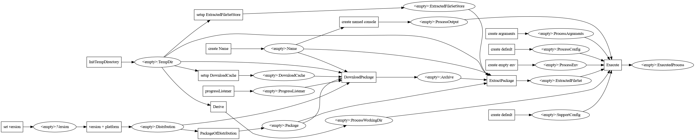

# How to run a process

```java

Transitions transitions = Transitions.from(
  InitTempDirectory.with(temp),

  Derive.given(de.flapdoodle.embed.process.io.directories.TempDir.class)
      .state(ProcessWorkingDir.class)
      .with(tempDir -> {
          Path workDir = Try.get(() -> tempDir.createDirectory("workDir"));
          return State.of(ProcessWorkingDir.of(workDir), w -> {
            Try.run(() -> Files.deleteIfExists(w.value()));
          });
        }),

  Derive.given(de.flapdoodle.embed.process.io.directories.TempDir.class)
    .state(DownloadCache.class)
    .deriveBy(tempDir -> new LocalDownloadCache(tempDir.value().resolve("archives")))
    .withTransitionLabel("setup DownloadCache"),

  Derive.given(de.flapdoodle.embed.process.io.directories.TempDir.class)
    .state(ExtractedFileSetStore.class)
    .deriveBy(tempDir -> new ContentHashExtractedFileSetStore(tempDir.value().resolve("fileSets")))
    .withTransitionLabel("setup ExtractedFileSetStore"),

  Start.to(Name.class).initializedWith(Name.of("phantomjs")).withTransitionLabel("create Name"),

  Start.to(SupportConfig.class).initializedWith(SupportConfig.generic()).withTransitionLabel("create default"),
  Start.to(ProcessConfig.class).initializedWith(ProcessConfig.defaults()).withTransitionLabel("create default"),
  Start.to(ProcessEnv.class).initializedWith(ProcessEnv.of(Collections.emptyMap())).withTransitionLabel("create empty env"),

  Start.to(Version.class).initializedWith(Version.of("2.1.1")).withTransitionLabel("set version"),
  Derive.given(Name.class).state(ProcessOutput.class)
    .deriveBy(name -> ProcessOutput.namedConsole(name.value()))
    .withTransitionLabel("create named console"),

  Start.to(ProcessArguments.class).initializedWith(ProcessArguments.of(Arrays.asList("--help")))
    .withTransitionLabel("create arguments"),

  Derive.given(Version.class).state(Distribution.class)
    .deriveBy(Distribution::detectFor)
    .withTransitionLabel("version + platform"),

  PackageOfDistribution.with(dist -> Package.builder()
    .archiveType(ArchiveType.TBZ2)
    .fileSet(FileSet.builder().addEntry(FileType.Executable, "phantomjs").build())
    .url(serverUrl + "phantomjs-" + dist.version().asInDownloadPath() + "-linux-x86_64.tar.bz2")
    .build()),

  DownloadPackage.withDefaults(),

  ExtractPackage.withDefaults()
    .withExtractedFileSetStore(StateID.of(ExtractedFileSetStore.class)),

  Executer.withDefaults()
);

TransitionWalker init = transitions.walker();

String dot = Transitions.edgeGraphAsDot("sample", transitions.asGraph());
recording.output("sample.dot", dot);

try (TransitionWalker.ReachedState<Archive> withArchive = init.initState(StateID.of(Archive.class))) {
  try (TransitionWalker.ReachedState<ExtractedFileSet> withFileSet = withArchive.initState(StateID.of(ExtractedFileSet.class))) {
    try (TransitionWalker.ReachedState<ExecutedProcess> started = withFileSet.initState(StateID.of(ExecutedProcess.class))) {
      assertThat(started.current().returnCode())
        .isEqualTo(0);
    }
  }
}

```

```dot
digraph "sample" {
	rankdir=LR;

	"<empty>:class de.flapdoodle.embed.process.types.Archive"[ shape="ellipse", label="<empty>:Archive" ];
	"<empty>:class de.flapdoodle.embed.process.distribution.Distribution"[ shape="ellipse", label="<empty>:Distribution" ];
	"<empty>:interface de.flapdoodle.embed.process.store.DownloadCache"[ shape="ellipse", label="<empty>:DownloadCache" ];
	"<empty>:interface de.flapdoodle.embed.process.types.ExecutedProcess"[ shape="ellipse", label="<empty>:ExecutedProcess" ];
	"<empty>:class de.flapdoodle.embed.process.archives.ExtractedFileSet"[ shape="ellipse", label="<empty>:ExtractedFileSet" ];
	"<empty>:interface de.flapdoodle.embed.process.store.ExtractedFileSetStore"[ shape="ellipse", label="<empty>:ExtractedFileSetStore" ];
	"<empty>:class de.flapdoodle.embed.process.types.Name"[ shape="ellipse", label="<empty>:Name" ];
	"<empty>:interface de.flapdoodle.embed.process.config.store.Package"[ shape="ellipse", label="<empty>:Package" ];
	"<empty>:class de.flapdoodle.embed.process.types.ProcessArguments"[ shape="ellipse", label="<empty>:ProcessArguments" ];
	"<empty>:interface de.flapdoodle.embed.process.types.ProcessConfig"[ shape="ellipse", label="<empty>:ProcessConfig" ];
	"<empty>:class de.flapdoodle.embed.process.types.ProcessEnv"[ shape="ellipse", label="<empty>:ProcessEnv" ];
	"<empty>:interface de.flapdoodle.embed.process.io.ProcessOutput"[ shape="ellipse", label="<empty>:ProcessOutput" ];
	"<empty>:class de.flapdoodle.embed.process.types.ProcessWorkingDir"[ shape="ellipse", label="<empty>:ProcessWorkingDir" ];
	"<empty>:interface de.flapdoodle.embed.process.config.SupportConfig"[ shape="ellipse", label="<empty>:SupportConfig" ];
	"<empty>:class de.flapdoodle.embed.process.io.directories.TempDir"[ shape="ellipse", label="<empty>:TempDir" ];
	"<empty>:interface de.flapdoodle.embed.process.distribution.Version"[ shape="ellipse", label="<empty>:Version" ];
	"de.flapdoodle.reverse.transitions.ImmutableDerive:0"[ shape="rectangle", label="Derive" ];
	"de.flapdoodle.embed.process.transitions.ImmutableDownloadPackage:0"[ shape="rectangle", label="DownloadPackage" ];
	"de.flapdoodle.embed.process.transitions.ImmutableExecuter:0"[ shape="rectangle", label="Execute" ];
	"de.flapdoodle.embed.process.transitions.ImmutableExtractPackage:0"[ shape="rectangle", label="ExtractPackage" ];
	"de.flapdoodle.embed.process.transitions.ImmutableInitTempDirectory:0"[ shape="rectangle", label="InitTempDirectory" ];
	"de.flapdoodle.embed.process.transitions.ImmutablePackageOfDistribution:0"[ shape="rectangle", label="PackageOfDistribution" ];
	"de.flapdoodle.reverse.transitions.ImmutableStart:0"[ shape="rectangle", label="create Name" ];
	"de.flapdoodle.reverse.transitions.ImmutableStart:1"[ shape="rectangle", label="create arguments" ];
	"de.flapdoodle.reverse.transitions.ImmutableStart:2"[ shape="rectangle", label="create default" ];
	"de.flapdoodle.reverse.transitions.ImmutableStart:3"[ shape="rectangle", label="create default" ];
	"de.flapdoodle.reverse.transitions.ImmutableStart:4"[ shape="rectangle", label="create empty env" ];
	"de.flapdoodle.reverse.transitions.ImmutableDerive:1"[ shape="rectangle", label="create named console" ];
	"de.flapdoodle.reverse.transitions.ImmutableStart:5"[ shape="rectangle", label="set version" ];
	"de.flapdoodle.reverse.transitions.ImmutableDerive:2"[ shape="rectangle", label="setup DownloadCache" ];
	"de.flapdoodle.reverse.transitions.ImmutableDerive:3"[ shape="rectangle", label="setup ExtractedFileSetStore" ];
	"de.flapdoodle.reverse.transitions.ImmutableDerive:4"[ shape="rectangle", label="version + platform" ];

	"<empty>:class de.flapdoodle.embed.process.types.Archive" -> "de.flapdoodle.embed.process.transitions.ImmutableExtractPackage:0";
	"<empty>:class de.flapdoodle.embed.process.distribution.Distribution" -> "de.flapdoodle.embed.process.transitions.ImmutableDownloadPackage:0";
	"<empty>:class de.flapdoodle.embed.process.distribution.Distribution" -> "de.flapdoodle.embed.process.transitions.ImmutablePackageOfDistribution:0";
	"<empty>:interface de.flapdoodle.embed.process.store.DownloadCache" -> "de.flapdoodle.embed.process.transitions.ImmutableDownloadPackage:0";
	"<empty>:class de.flapdoodle.embed.process.archives.ExtractedFileSet" -> "de.flapdoodle.embed.process.transitions.ImmutableExecuter:0";
	"<empty>:interface de.flapdoodle.embed.process.store.ExtractedFileSetStore" -> "de.flapdoodle.embed.process.transitions.ImmutableExtractPackage:0";
	"<empty>:class de.flapdoodle.embed.process.types.Name" -> "de.flapdoodle.embed.process.transitions.ImmutableDownloadPackage:0";
	"<empty>:class de.flapdoodle.embed.process.types.Name" -> "de.flapdoodle.embed.process.transitions.ImmutableExtractPackage:0";
	"<empty>:class de.flapdoodle.embed.process.types.Name" -> "de.flapdoodle.reverse.transitions.ImmutableDerive:1";
	"<empty>:interface de.flapdoodle.embed.process.config.store.Package" -> "de.flapdoodle.embed.process.transitions.ImmutableDownloadPackage:0";
	"<empty>:interface de.flapdoodle.embed.process.config.store.Package" -> "de.flapdoodle.embed.process.transitions.ImmutableExtractPackage:0";
	"<empty>:class de.flapdoodle.embed.process.types.ProcessArguments" -> "de.flapdoodle.embed.process.transitions.ImmutableExecuter:0";
	"<empty>:interface de.flapdoodle.embed.process.types.ProcessConfig" -> "de.flapdoodle.embed.process.transitions.ImmutableExecuter:0";
	"<empty>:class de.flapdoodle.embed.process.types.ProcessEnv" -> "de.flapdoodle.embed.process.transitions.ImmutableExecuter:0";
	"<empty>:interface de.flapdoodle.embed.process.io.ProcessOutput" -> "de.flapdoodle.embed.process.transitions.ImmutableExecuter:0";
	"<empty>:class de.flapdoodle.embed.process.types.ProcessWorkingDir" -> "de.flapdoodle.embed.process.transitions.ImmutableExecuter:0";
	"<empty>:interface de.flapdoodle.embed.process.config.SupportConfig" -> "de.flapdoodle.embed.process.transitions.ImmutableExecuter:0";
	"<empty>:class de.flapdoodle.embed.process.io.directories.TempDir" -> "de.flapdoodle.reverse.transitions.ImmutableDerive:0";
	"<empty>:class de.flapdoodle.embed.process.io.directories.TempDir" -> "de.flapdoodle.embed.process.transitions.ImmutableDownloadPackage:0";
	"<empty>:class de.flapdoodle.embed.process.io.directories.TempDir" -> "de.flapdoodle.embed.process.transitions.ImmutableExtractPackage:0";
	"<empty>:class de.flapdoodle.embed.process.io.directories.TempDir" -> "de.flapdoodle.reverse.transitions.ImmutableDerive:2";
	"<empty>:class de.flapdoodle.embed.process.io.directories.TempDir" -> "de.flapdoodle.reverse.transitions.ImmutableDerive:3";
	"<empty>:interface de.flapdoodle.embed.process.distribution.Version" -> "de.flapdoodle.reverse.transitions.ImmutableDerive:4";
	"de.flapdoodle.reverse.transitions.ImmutableDerive:0" -> "<empty>:class de.flapdoodle.embed.process.types.ProcessWorkingDir";
	"de.flapdoodle.embed.process.transitions.ImmutableDownloadPackage:0" -> "<empty>:class de.flapdoodle.embed.process.types.Archive";
	"de.flapdoodle.embed.process.transitions.ImmutableExecuter:0" -> "<empty>:interface de.flapdoodle.embed.process.types.ExecutedProcess";
	"de.flapdoodle.embed.process.transitions.ImmutableExtractPackage:0" -> "<empty>:class de.flapdoodle.embed.process.archives.ExtractedFileSet";
	"de.flapdoodle.embed.process.transitions.ImmutableInitTempDirectory:0" -> "<empty>:class de.flapdoodle.embed.process.io.directories.TempDir";
	"de.flapdoodle.embed.process.transitions.ImmutablePackageOfDistribution:0" -> "<empty>:interface de.flapdoodle.embed.process.config.store.Package";
	"de.flapdoodle.reverse.transitions.ImmutableStart:0" -> "<empty>:class de.flapdoodle.embed.process.types.Name";
	"de.flapdoodle.reverse.transitions.ImmutableStart:1" -> "<empty>:class de.flapdoodle.embed.process.types.ProcessArguments";
	"de.flapdoodle.reverse.transitions.ImmutableStart:3" -> "<empty>:interface de.flapdoodle.embed.process.types.ProcessConfig";
	"de.flapdoodle.reverse.transitions.ImmutableStart:2" -> "<empty>:interface de.flapdoodle.embed.process.config.SupportConfig";
	"de.flapdoodle.reverse.transitions.ImmutableStart:4" -> "<empty>:class de.flapdoodle.embed.process.types.ProcessEnv";
	"de.flapdoodle.reverse.transitions.ImmutableDerive:1" -> "<empty>:interface de.flapdoodle.embed.process.io.ProcessOutput";
	"de.flapdoodle.reverse.transitions.ImmutableStart:5" -> "<empty>:interface de.flapdoodle.embed.process.distribution.Version";
	"de.flapdoodle.reverse.transitions.ImmutableDerive:2" -> "<empty>:interface de.flapdoodle.embed.process.store.DownloadCache";
	"de.flapdoodle.reverse.transitions.ImmutableDerive:3" -> "<empty>:interface de.flapdoodle.embed.process.store.ExtractedFileSetStore";
	"de.flapdoodle.reverse.transitions.ImmutableDerive:4" -> "<empty>:class de.flapdoodle.embed.process.distribution.Distribution";
}

```



